<p align="center">
  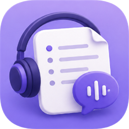
</p>

<h1 align="center">PodMuse</h1>
<p align="center"><strong>把播客变成你的第二大脑 🧠</strong></p>
<p align="center">粘贴一条链接，AI 自动转写、提炼、结构化，让每一期节目都沉淀为可复用、可互链的知识资产</p>

---

## 为什么做 PodMuse？

听过的好节目总会忘记。PodMuse 帮你把「听」变成「存」：

- **不再回听**：一句话总结 + 要点，扫一眼就想起整期内容
- **知识互链**：节目中提到的人物、公司、概念自动生成卡片并互相链接，形成你的专属知识网络
- **随时可问**：对着笔记库提问，答案带引用来源，比搜索引擎更懂你的上下文

笔记以标准 Markdown 形式落到你**自己的笔记库**（兼容 Obsidian、Logseq 及任意支持 Markdown 链接的笔记工具），数据完全属于你。

## ✨ 功能一览

| 类别 | 功能 |
| --- | --- |
| 📥 **内容获取** | 小宇宙 / B站 / 喜马拉雅 / Apple Podcasts / 抖音 / YouTube 链接一键识别；浏览器复制链接自动弹窗剪藏；播客订阅自动追踪新节目 |
| 🎙 **智能转写** | 本地 Whisper 转写（支持平台字幕直取）；音频与转写结果自动缓存，重复处理秒级完成 |
| 📝 **AI 结构化笔记** | 一句话总结、核心观点、事件详情、金句摘录、术语词典、实体卡片，全自动生成 |
| 🧠 **知识库沉淀** | 人物 / 项目 / 概念 / 术语四类实体自动建档与互链；悬停预览；全局反向链接 |
| 💬 **知识问答** | 基于笔记库的 RAG 问答，每个回答附引用来源 |
| ⚙️ **处理体验** | 多任务批量队列、实时步骤面板、失败一键重试、处理历史（筛选/搜索/分页/重新生成可换模型） |
| 📤 **内容输出** | 单篇 / 合集 PDF、Markdown 导出、1080×1440 分享卡片、Notion / Logseq 同步 |
| 🔌 **模型自由** | DeepSeek / 小米 MiMo / OpenAI 兼容接口；单任务级模型覆盖 |
| ⚡ **持续更新** | 增量自动更新，新版本即装即用 |

## 📸 界面预览 · Screenshots

| 工作台 · Workspace | 笔记库 · Library |
| :---: | :---: |
| 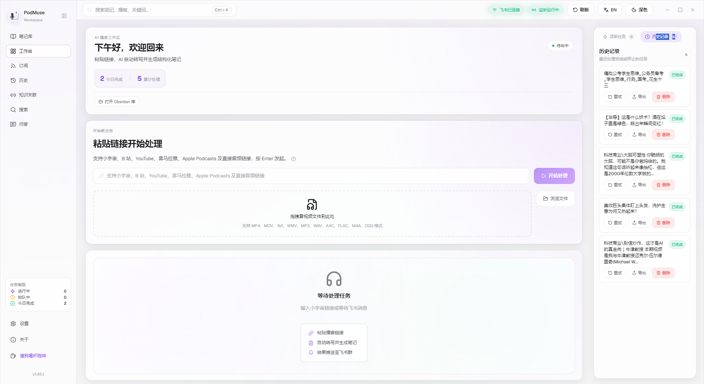 | 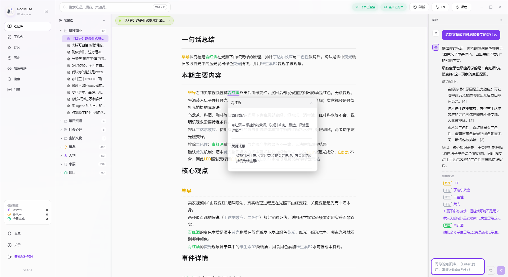 |

| 知识关联 · Knowledge Graph | 实体展示 · Entities |
| :---: | :---: |
| 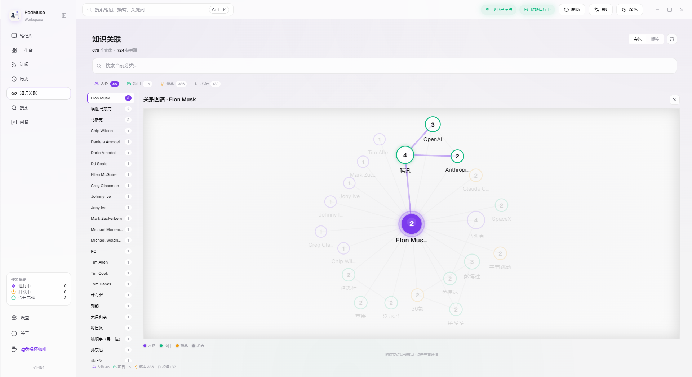 | 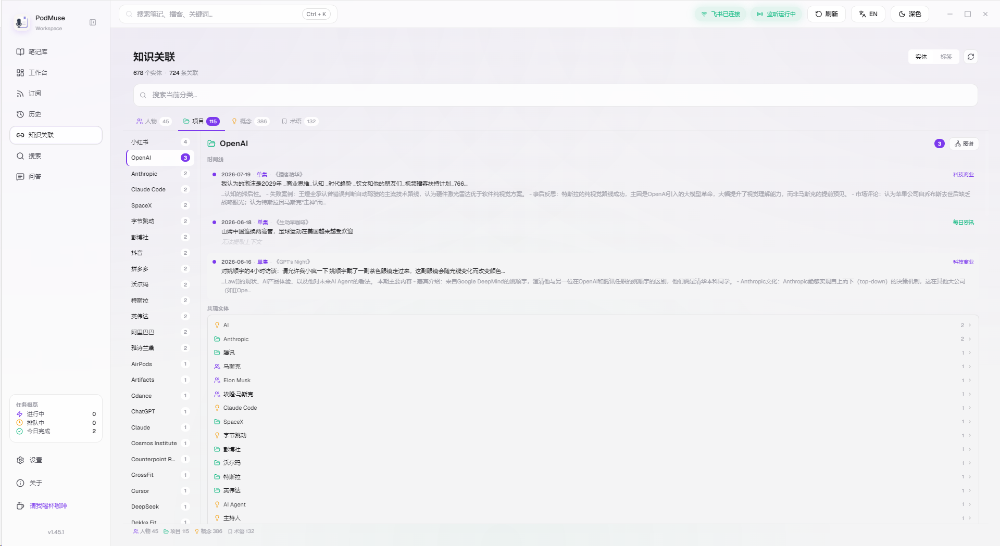 |

| AI 问答 · Q&A | 订阅 · Subscriptions |
| :---: | :---: |
| 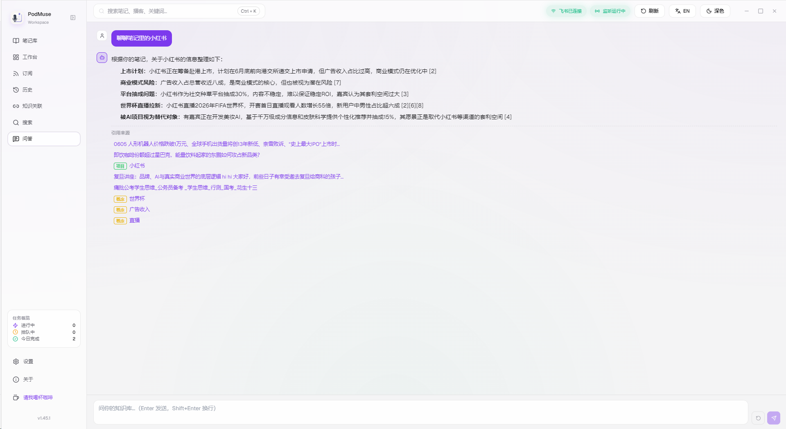 | 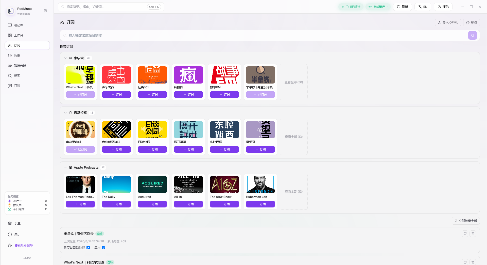 |

| 历史 · History | 搜索 · Search |
| :---: | :---: |
| 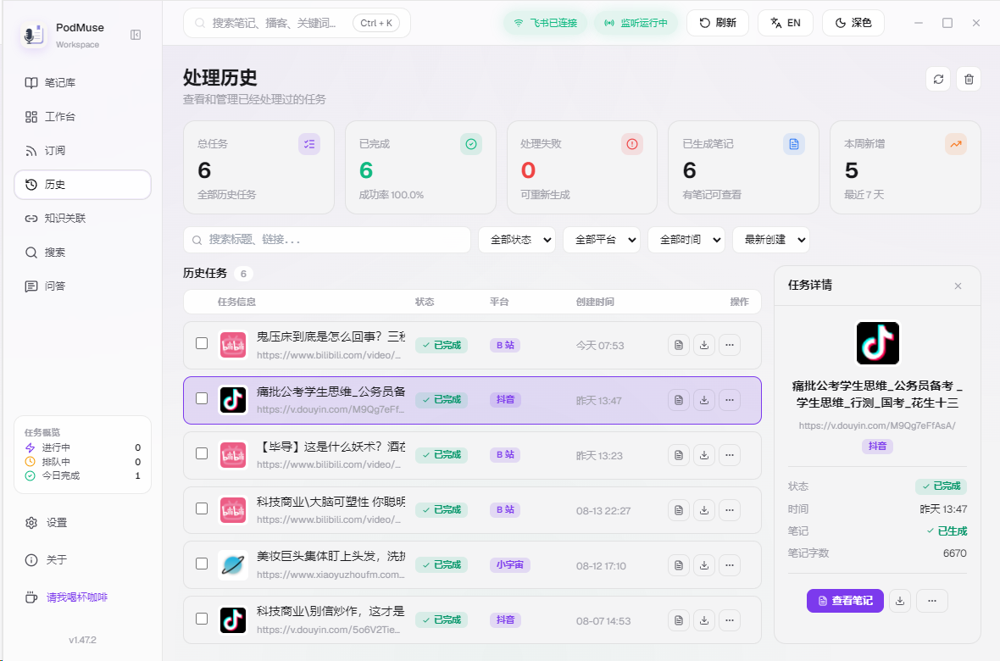 | 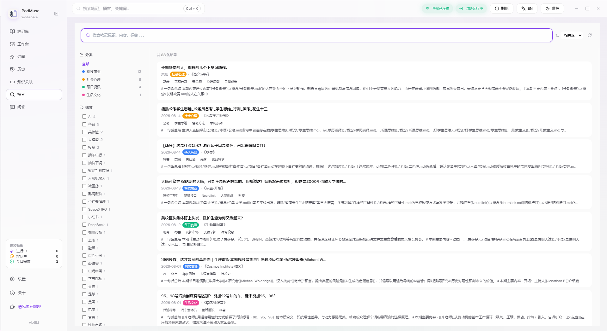 |

| 剪藏插件 · Extension | 分享卡片 · Share Card |
| :---: | :---: |
| 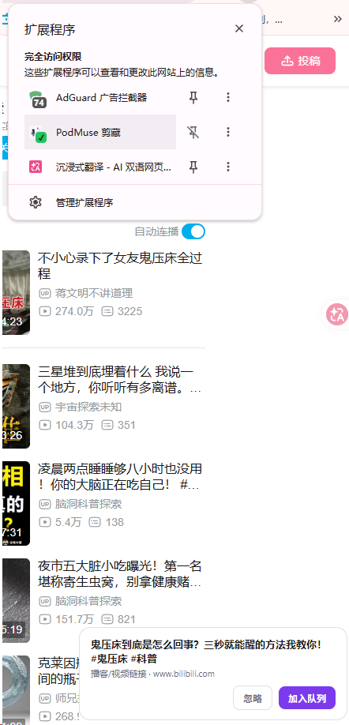 | 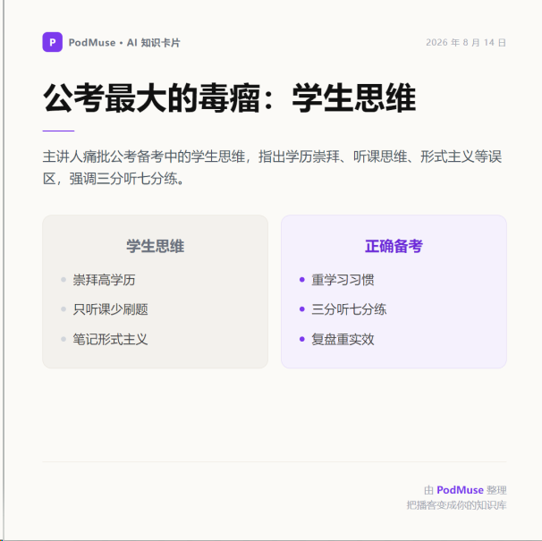 |

#### PDF 导出 · PDF Export

| 样式 1 | 样式 2 | 样式 3 |
| :---: | :---: | :---: |
| 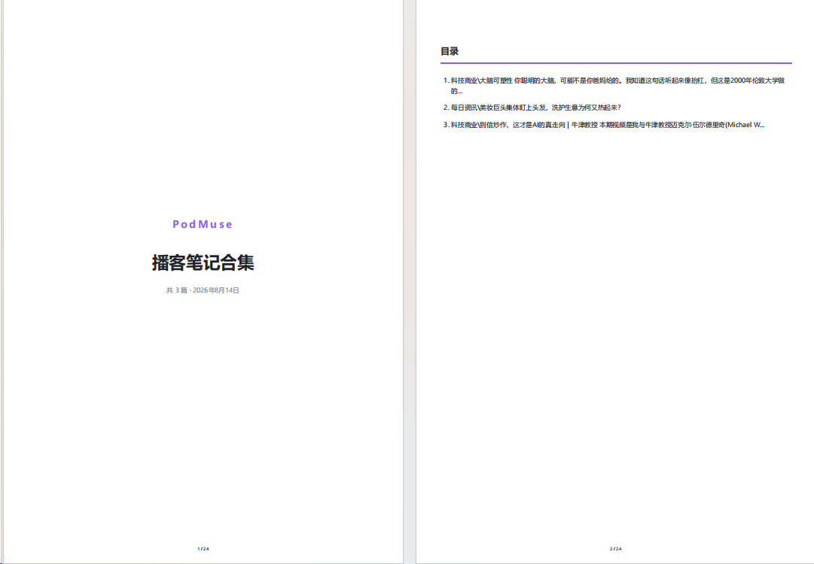 | 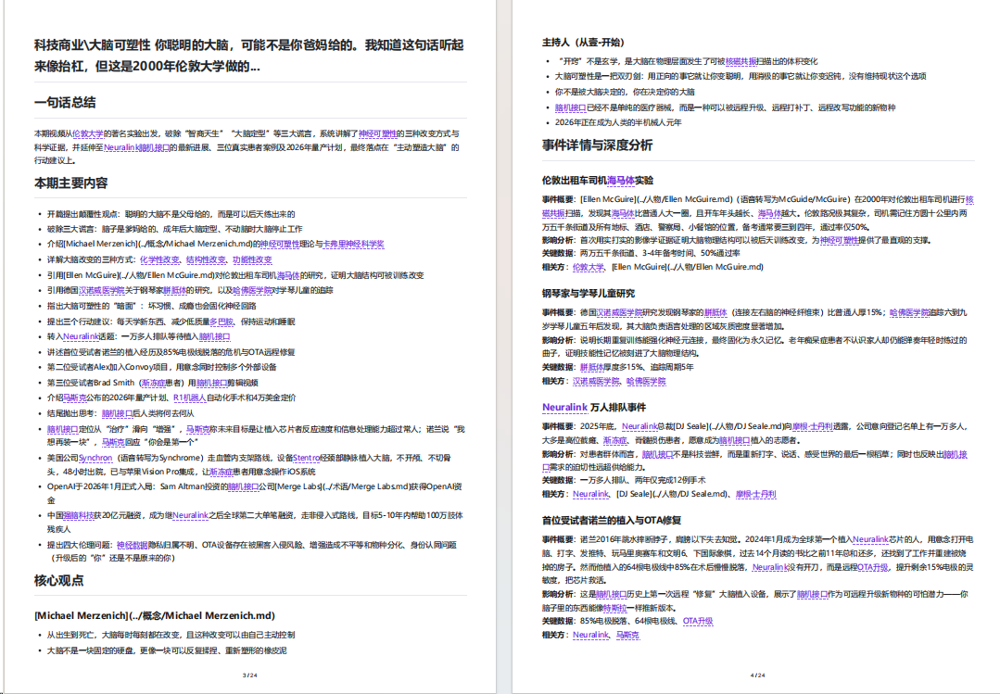 | 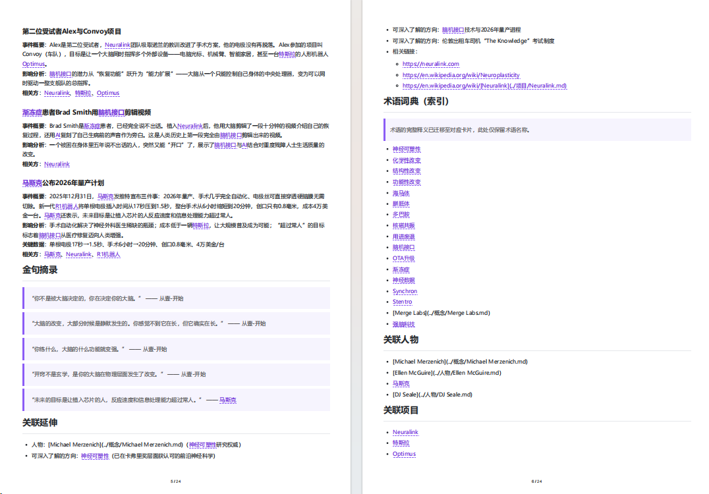 |

## 🚀 快速开始

1. 到 [Releases](https://github.com/xuxuyouxiu/PodMuse/releases) 下载 `PodMuse-Setup-x.x.x.exe` 并安装
2. 打开设置：指定**笔记库存放目录**，填入** AI 模型 API Key**（如 DeepSeek / 小米 MiMo）
3. 回到工作台，粘贴一条播客或视频链接，开始处理
4. 完成后去「笔记库」翻看：实体卡片已经自动互链，试试「问答」直接提问

> 💡 语音转写使用本地 Whisper，首次使用会提示下载语音模型（免费、离线）。

## 🧩 剪藏插件怎么用

复制链接自动弹窗、一键送入 PodMuse 处理的浏览器剪藏扩展（本地加载，无需商店）：

1. 打开浏览器扩展管理页：
   - Chrome / Edge：地址栏输入 `chrome://extensions`（Edge 为 `edge://extensions`）
2. 打开右上角 **「开发者模式」** 开关
3. 点击 **「加载已解压的扩展程序」**，选择项目里的 `chrome-extension/` 目录
4. 完成！之后你在浏览器里**复制任意播客 / 视频链接**，页面右下角会自动弹出 PodMuse 剪藏小窗——点击确认，链接直接送进软件处理队列

> ⚠️ 扩展更新后（`chrome-extension/` 目录内容变化），回到扩展管理页点一下 PodMuse 卡片的**刷新图标**即可。

## 🛠 技术栈

Electron · TypeScript · React · Whisper（本地转写）· yt-dlp（视频提取）· rss-parser（订阅）· electron-updater（自动更新）

## 📁 项目结构

```
PodMuse/
├── src/main/          # Electron 主进程：处理管线 / 平台适配器 / IPC / 订阅 / 剪藏服务
├── src/renderer/      # React 界面：工作台 / 笔记库 / 历史 / 问答 / 设置
├── src/shared/        # 共享类型与工具
├── public/            # 静态资源（分享卡模板 / 平台图标 / 收款码）
├── chrome-extension/  # 浏览器剪藏扩展（本地加载，免商店）
└── docs/              # 设计文档
```

## ☕ 支持作者

如果 PodMuse 帮你省下了时间，一杯咖啡就是最好的鼓励 —— 谢谢！

| 微信支付 | 支付宝 |
| :---: | :---: |
|  |  |

---

## 🇬🇧 English Version

<p align="center"><strong>PodMuse — Turn podcasts into your second brain 🧠</strong></p>
<p align="center">Paste a link, and AI transcribes, distills and structures every episode into reusable, interlinked knowledge assets.</p>

### Why PodMuse?

Great episodes get forgotten. PodMuse turns "listening" into "keeping":

- **No more re-listening** — a one-line summary plus key points brings the whole episode back at a glance
- **Interlinked knowledge** — people, companies and concepts mentioned in episodes become auto-linked entity cards, growing into your personal knowledge graph
- **Ask anything** — Q&A over your own notes with cited sources, more context-aware than any search engine

Notes are saved as standard Markdown into **your own note vault** (compatible with Obsidian, Logseq and any Markdown-friendly tool) — your data stays yours.

### Features

| Category | Highlights |
| --- | --- |
| 📥 **Capture** | One-click processing for 小宇宙 / Bilibili / Ximalaya / Apple Podcasts / Douyin / YouTube; clipboard clipping with popup; subscriptions that auto-track new episodes |
| 🎙 **Transcription** | Local Whisper (or platform subtitles) with audio/transcript caching for instant re-processing |
| 📝 **AI Notes** | Summary, key viewpoints, event details, quotes, glossary and entity cards — fully automated |
| 🧠 **Knowledge Base** | People / Projects / Concepts / Terms auto-filed and interlinked; hover previews; global backlinks |
| 💬 **Q&A** | RAG over your note vault, every answer with cited sources |
| ⚙️ **Workflow** | Batch queue, live step panel, one-click retry, processing history with search / filters / pagination / regenerate-with-model-choice |
| 📤 **Export** | Single & collection PDF, Markdown, 1080×1440 share cards, Notion / Logseq sync |
| 🔌 **Models** | DeepSeek / Xiaomi MiMo / OpenAI-compatible APIs; per-task model override |
| ⚡ **Updates** | Incremental auto-updates |

### Getting Started

1. Download `PodMuse-Setup-x.x.x.exe` from [Releases](https://github.com/xuxuyouxiu/PodMuse/releases)
2. Settings → choose your **note vault directory** and fill in your **AI API key**
3. Paste a podcast or video link in the workspace and start processing
4. Browse your notes — entity cards are already interlinked; try asking questions in the Q&A view

> 💡 Transcription runs on local Whisper; the app will prompt you to download the speech model on first use (free, offline).

### 🧩 Browser Clipper (How to Use)

The clipboard-clipping extension pops up whenever you copy a podcast/video link and sends it straight to PodMuse (loaded locally, no store needed):

1. Open the extensions page in your browser: `chrome://extensions` (or `edge://extensions`)
2. Turn on **Developer mode** (top-right switch)
3. Click **"Load unpacked"** and select the `chrome-extension/` folder in this repo
4. Done! Copy any podcast / video link in your browser — a PodMuse clipping popup appears at the bottom-right; confirm it and the link goes straight into the processing queue

> ⚠️ After the extension is updated, click the refresh icon on the PodMuse card in the extensions page.

### Tech Stack

Electron · TypeScript · React · Whisper (local STT) · yt-dlp (media extraction) · rss-parser (subscriptions) · electron-updater (auto-update)

### Support

If PodMuse saved you some time, a coffee is the best way to say thanks! ☕ *(see QR codes above)*

---

**License:** MIT
